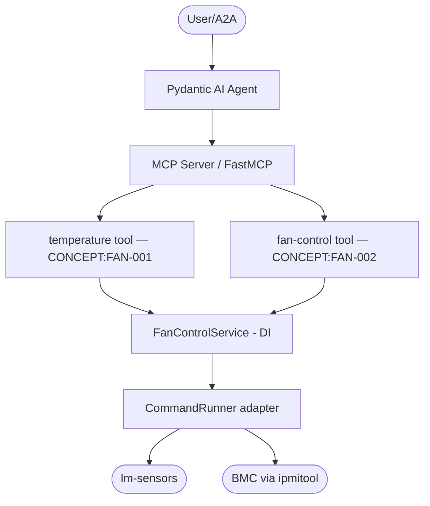

# AGENTS.md

> Claude Code loads this file via `CLAUDE.md` (`@AGENTS.md` import) — the two stay
> in sync. Edit **this** file, not `CLAUDE.md`.

## Tech Stack & Architecture
- Language/Version: Python 3.11+
- Core Libraries: `agent-utilities`, `fastmcp` (via `agent-utilities[mcp]`), `pydantic-ai`
- Domain: **local** Dell PowerEdge thermal control — `ipmitool` (fan) + `lm-sensors` (temperature). No remote API/credentials.
- Key principles: Functional patterns, Pydantic for data validation, asynchronous tool execution, action-routed MCP tools.

### Architecture & Deliberate Simplicity

Fan Manager is a **small local tool**, so it deliberately avoids a full
domain/adapter/port hexagonal split — that would be over-engineering for a
two-concept package. The design makes exactly the highest-value seam instead:

- **Adapter seam (DI):** `CommandRunner` (a `Protocol` in `fan_manager.fan_manager`)
  abstracts the `sensors`/`ipmitool` shell-out; `SubprocessCommandRunner` is the
  production implementation. Tests inject a fake runner rather than monkeypatching
  `subprocess` globally.
- **Service layer (DI):** `fan_manager/services/FanControlService` composes the
  injected `CommandRunner` + runtime config and exposes the temperature
  (`CONCEPT:FAN-001`) and fan-control (`CONCEPT:FAN-002`) operations. The `Api`
  facade composes this service.
- **Model layer:** `fan_manager/models.py` holds the Pydantic envelopes.

Anything beyond this (separate `domain/`, `ports/`, `adapters/` packages) is
intentionally *not* added — it would add indirection without value at this size.

### Architecture Diagram


## Commands (run these exactly)
# Installation
pip install .[all]

# Quality & Linting (run from project root)
pre-commit run --all-files

# Execution Commands
# fan-manager        -> fan_manager.fan_manager:fan_manager   (CLI service)
# fan-manager-mcp    -> fan_manager.mcp_server:mcp_server      (MCP server)
# fan-manager-agent  -> fan_manager.agent_server:agent_server  (A2A agent)

## Project Structure Quick Reference
- Core logic → `fan_manager/fan_manager.py`
- MCP Entry Point → `fan_manager/mcp_server.py`
- Action-routed tools → `fan_manager/mcp/` (`mcp_temperature.py`, `mcp_fan_control.py`)
- Agent Entry Point → `fan_manager/agent_server.py`
- Local-command facade → `fan_manager/api_client.py`
- Concept registry → `docs/concepts.md` (`CONCEPT:FAN-*`)

### File Tree
```text
├── .bumpversion.cfg
├── .codespellignore
├── .dockerignore
├── .env.example
├── .gitattributes
├── .github/workflows/{docs.yml,pages.yml,pipeline.yml}
├── .gitignore
├── .pre-commit-config.yaml
├── AGENTS.md
├── CHANGELOG.md
├── CLAUDE.md
├── LICENSE
├── MANIFEST.in
├── README.md
├── docker/
│   ├── Dockerfile
│   ├── debug.Dockerfile
│   ├── mcp.compose.yml
│   ├── agent.compose.yml
│   └── starship.toml
├── docs/
│   ├── index.md
│   ├── overview.md
│   ├── installation.md
│   ├── usage.md
│   ├── deployment.md
│   └── concepts.md
├── fan_manager/
│   ├── __init__.py
│   ├── __main__.py
│   ├── fan_manager.py        # core logic (CLI, sensors, IPMI)
│   ├── api_client.py         # local-command facade (Api)
│   ├── models.py
│   ├── auth.py               # no-op/local auth
│   ├── middlewares.py
│   ├── mcp_server.py
│   ├── agent_server.py
│   ├── main_agent.json
│   ├── mcp_config.json
│   ├── agent_data/IDENTITY.md
│   ├── mcp/
│   │   ├── __init__.py
│   │   ├── mcp_temperature.py
│   │   └── mcp_fan_control.py
│   └── skills/
├── mcp_config.json
├── mkdocs.yml
├── pyproject.toml
├── pytest.ini
├── requirements.txt
├── scripts/                  # pre-commit verifiers (integration parity, sanitizer)
└── tests/
```

## Code Style & Conventions
**Always:**
- Use `agent-utilities` for common patterns (`create_mcp_server`, `create_agent_server`).
- Define input/output models using Pydantic (`fan_manager/models.py`).
- Include descriptive docstrings on all MCP tools (they are the LLM tool descriptions) and embed the `CONCEPT:FAN-*` id.
- Check for optional dependencies using `try/except ImportError`.

## Dos and Don'ts
**Do:**
- Run `pre-commit` before pushing changes.
- Keep tools focused, action-routed, and idempotent where possible.
- Wrap the real callables in `fan_manager/fan_manager.py` — never duplicate the logic.

**Don't:**
- Add new runtime deps without checking `optional-dependencies` first.
- Hardcode secrets; this tool needs none (it is local).
- Re-introduce a bespoke FastMCP server — register tools via `fan_manager/mcp/`.

## Safety & Boundaries
- Fan control issues raw IPMI commands; validate fan levels are within 0-100.
- On a temperature read failure during automatic control, fail safe to maximum fans.

**Never do:**
- Commit `.env` files or secrets.
- Modify `agent-utilities` or `universal-skills` files from within this package.

## ⛔ Keep the Repository Root Pristine
The repository ROOT must contain only canonical project files (packaging, config,
docs, lockfiles). The only hidden dirs allowed at root are `.git/`, `.github/`,
and `.specify/` (plus a local, git-ignored `.venv/`). Never write debug/scratch
scripts, logs, dumps, or build artifacts anywhere in the repo. Scratch goes in
`~/workspace/scratch/`; tests go in `tests/` (pytest).

## Working with Git Worktrees (multi-session)
Do not edit the canonical checkout — a background `repository-manager` sync can
reset its working tree. Take your own git worktree on your own branch under
`/home/apps/worktrees/`, commit often, then merge to main locally. Push only when
asked.

## Working Discipline — think, simplify, stay surgical, verify

These four habits cut the most common LLM coding mistakes. For trivial tasks, use
judgment; the bias here is correctness over speed.

- **Think before coding.** State your assumptions explicitly. If a request has more than
  one reasonable reading, surface the options instead of silently picking one. If a
  simpler approach exists, say so and push back when warranted. When something is
  genuinely unclear, stop and name what's confusing — ask, don't guess.
- **Simplicity first.** Write the minimum code that solves the stated problem — no
  speculative features, no abstraction for single-use code, no configurability that
  wasn't requested, no error handling for impossible states. If you wrote 200 lines and
  it could be 50, rewrite it. (Name code from its purpose, never `wave0`/`phase2`/`v2`.)
- **Stay surgical.** Every changed line should trace directly to the task. Don't refactor,
  reformat, or "improve" working code adjacent to your change; match the existing style
  even where you'd do it differently. Remove only the imports/symbols your own change
  orphaned; if you spot unrelated dead code, mention it rather than deleting it inline.
  *Exception — the Quality Bar below:* lint/format/type errors the pre-commit gate flags
  get fixed regardless of who introduced them. In short: **surgical on behavior, clean on
  lint.**
- **Verify against a goal.** Turn the task into a checkable outcome before you start:
  "fix the bug" → "write a failing test that reproduces it, then make it pass"; "add
  validation" → "tests for the invalid inputs pass". For multi-step work, state the short
  plan and the check for each step, then loop until the checks pass.

## Quality Bar — Leave the Codebase Clean (REQUIRED)

After completing any code change, run the project's pre-commit suite and drive it
**fully green** before committing:

```bash
pre-commit run --all-files
```

Resolve **every** issue it reports — failures, lint errors, type errors, and
warnings — **including problems that pre-date your change and were not caused by
your edits**. The standing goal is a clean, working codebase with **no errors and
no warnings**. Do not silence checks (`# noqa`, `# type: ignore`, `SKIP=`,
`--no-verify`) to force green unless the exception is already documented in this
file as a known, unavoidable limitation. Only commit once `pre-commit run
--all-files` passes cleanly; if a check legitimately cannot pass, stop and explain
why rather than bypassing it.

## Working with Git Worktrees (multi-session)

Multiple agents/sessions work the `agent-packages/*` repos concurrently. **Do not
edit the canonical checkout** (`/home/apps/workspace/agent-packages/<repo>`) — a
background `repository-manager` sync can reset its working tree and discard
uncommitted edits. Take your own git worktree on your own branch instead:

```bash
# preferred — repository-manager MCP:
rm_worktree add <repo> <your-branch>      # -> /home/apps/worktrees/<repo>/<your-branch>

# raw-git fallback:
git -C agent-packages/<repo> checkout main
git -C agent-packages/<repo> worktree add /home/apps/worktrees/<repo>/<branch> -b <branch>
```

Work in the worktree and **commit often** (commits survive a working-tree reset).
Each session must use a **distinct branch** — git allows a branch in only one
worktree, which is what keeps concurrent sessions from colliding. Worktrees live
under `/home/apps/worktrees/` (outside the workspace scan, so the sync leaves them
alone).

**Finishing work in a worktree** — run this sequence before calling it done:
1. **Pre-commit green** — `pre-commit run --all-files`; resolve every issue per the
   Quality Bar above (including pre-existing), no `--no-verify`.
2. **Commit** in the worktree.
3. **Merge to main locally** — `rm_worktree merge <repo> <branch> --into main`
   (or `git merge --no-ff`). Push only when the user asks.
4. **Clean up** — remove the worktree and delete the merged branch:
   `rm_worktree remove <repo> <branch> --delete-branch`; `rm_worktree prune` clears
   stale entries. (Raw-git: `git worktree remove <path> && git branch -d <branch>`.)
