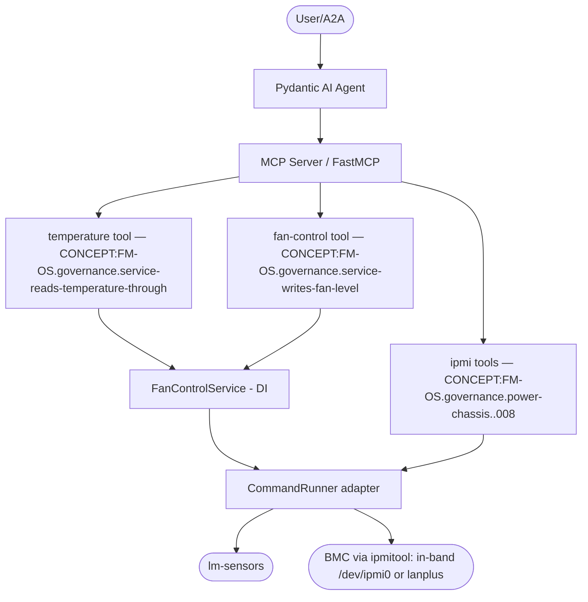

# AGENTS.md

> Claude Code loads this file via `CLAUDE.md` (`@AGENTS.md` import) — the two stay
> in sync. Edit **this** file, not `CLAUDE.md`.

## Tech Stack & Architecture
- Language/Version: Python 3.11+
- Core Libraries: `agent-utilities`, `fastmcp` (via `agent-utilities[mcp]`), `pydantic-ai`
- Domain: Dell PowerEdge / IPMI 2.0 control via `ipmitool` + `lm-sensors`. Thermal
  (fan/temperature) runs **local** with no creds; the **IPMI/BMC wrapper**
  (`CONCEPT:FM-OS.governance.power-chassis..008`: power, sensors, SEL, SoL, BMC LAN/user config, raw) runs
  **in-band** (local `/dev/ipmi0`) or **out-of-band** over LAN (`-I lanplus -H -U -P`,
  creds from OpenBao `apps/idrac`).
- Key principles: Functional patterns, Pydantic for data validation, asynchronous tool execution, action-routed MCP tools.

### Architecture & Deliberate Simplicity

Fan Manager is a **small local tool**, so it deliberately avoids a full
domain/adapter/port hexagonal split — that will be over-engineering for a
two-concept package. The design makes exactly the highest-value seam instead:

- **Adapter seam (DI):** `CommandRunner` (a `Protocol` in `fan_manager.fan_manager`)
  abstracts the `sensors`/`ipmitool` shell-out; `SubprocessCommandRunner` is the
  production implementation. Tests inject a fake runner rather than monkeypatching
  `subprocess` globally.
- **Service layer (DI):** `fan_manager/services/FanControlService` composes the
  injected `CommandRunner` + runtime config and exposes the temperature
  (`CONCEPT:FM-OS.governance.service-reads-temperature-through`) and fan-control (`CONCEPT:FM-OS.governance.service-writes-fan-level`) operations. The `Api`
  facade composes this service.
- **Model layer:** `fan_manager/models.py` holds the Pydantic envelopes.

Anything beyond this (separate `domain/`, `ports/`, `adapters/` packages) is
intentionally *not* added — it will add indirection without value at this size.

### Architecture Diagram

```mermaid
graph TD
    User([User/A2A]) --> Agent[Pydantic AI Agent]
    Agent --> MCP[MCP Server / FastMCP]
    MCP --> Temp[temperature tool — CONCEPT:FM-OS.governance.service-reads-temperature-through]
    MCP --> Fan[fan-control tool — CONCEPT:FM-OS.governance.service-writes-fan-level]
    MCP --> Ipmi[ipmi tools — CONCEPT:FM-OS.governance.power-chassis..008]
    Temp --> Service[FanControlService - DI]
    Fan --> Service
    Service --> Runner[CommandRunner adapter]
    Ipmi --> Runner
    Runner --> Sensors([lm-sensors])
    Runner --> IPMI([BMC via ipmitool: in-band /dev/ipmi0 or lanplus])
```

## Commands (run these exactly)
# Installation
pip install .[all]

# Quality & Linting (run from project root)
pre-commit run --all-files

# Execution Commands
# fan-manager        -> fan_manager.fan_manager:fan_manager   (CLI service)
# fan-manager-mcp    -> fan_manager.mcp_server:mcp_server      (MCP server)
# fan-manager-agent  -> fan_manager.agent_server:agent_server  (A2A agent)

## Project Structure Quick Reference
- Core logic → `fan_manager/fan_manager.py`
- MCP Entry Point → `fan_manager/mcp_server.py`
- Action-routed tools → `fan_manager/mcp/` (`mcp_temperature.py`, `mcp_fan_control.py`)
- Agent Entry Point → `fan_manager/agent_server.py`
- Local-command facade → `fan_manager/api_client.py`
- Concept registry → `docs/concepts.md` (`CONCEPT:FAN-*`)

### File Tree
```text
├── .bumpversion.cfg
├── .codespellignore
├── .dockerignore
├── .env.example
├── .gitattributes
├── .github/workflows/{docs.yml,pages.yml,pipeline.yml}
├── .gitignore
├── .pre-commit-config.yaml
├── AGENTS.md
├── CHANGELOG.md
├── CLAUDE.md
├── LICENSE
├── MANIFEST.in
├── README.md
├── docker/
│   ├── Dockerfile
│   ├── debug.Dockerfile
│   ├── mcp.compose.yml
│   ├── agent.compose.yml
│   └── starship.toml
├── docs/
│   ├── index.md
│   ├── overview.md
│   ├── installation.md
│   ├── usage.md
│   ├── deployment.md
│   └── concepts.md
├── fan_manager/
│   ├── __init__.py
│   ├── __main__.py
│   ├── fan_manager.py        # core logic (CLI, sensors, IPMI)
│   ├── api_client.py         # local-command facade (Api)
│   ├── models.py
│   ├── auth.py               # no-op/local auth
│   ├── middlewares.py
│   ├── mcp_server.py
│   ├── agent_server.py
│   ├── main_agent.json
│   ├── mcp_config.json
│   ├── mcp/
│   │   ├── __init__.py
│   │   ├── mcp_temperature.py
│   │   └── mcp_fan_control.py
│   └── skills/
├── mcp_config.json
├── mkdocs.yml
├── pyproject.toml
├── pytest.ini
├── requirements.txt
├── scripts/                  # pre-commit verifiers (integration parity, sanitizer)
└── tests/
```

## Code Style & Conventions
**Always:**
- Use `agent-utilities` for common patterns (`create_mcp_server`, `create_agent_server`).
- Define input/output models using Pydantic (`fan_manager/models.py`).
- Include descriptive docstrings on all MCP tools (they are the LLM tool descriptions) and embed the `CONCEPT:FAN-*` id.
- Check for optional dependencies using `try/except ImportError`.

## Dos and Don'ts
**Do:**
- Run `pre-commit` before pushing changes.
- Keep tools focused, action-routed, and idempotent where possible.
- Wrap the real callables in `fan_manager/fan_manager.py` — never duplicate the logic.

**Don't:**
- Add new runtime deps without checking `optional-dependencies` first.
- Hardcode secrets; this tool needs none (it is local).
- Re-introduce a bespoke FastMCP server — register tools via `fan_manager/mcp/`.

## Safety & Boundaries
- Fan control issues raw IPMI commands; validate fan levels are within 0-100.
- On a temperature read failure during automatic control, fail safe to maximum fans.

**Never do:**
- Commit `.env` files or secrets.
- Modify `agent-utilities` or `universal-skills` files from within this package.

## ⛔ Keep the Repository Root Pristine
The repository ROOT must contain only canonical project files (packaging, config,
docs, lockfiles). The only hidden dirs allowed at root are `.git/`, `.github/`,
and `.specify/` (plus a local, git-ignored `.venv/`). Never write debug/scratch
scripts, logs, dumps, or build artifacts anywhere in the repo. Scratch goes in
`~/workspace/scratch/`; tests go in `tests/` (pytest).

## Working with Git Worktrees (multi-session)
Do not edit the canonical checkout — a background `repository-manager` sync can
reset its working tree. Take the operator's own git worktree on the operator's own branch under
`${WORKTREE_ROOT}/`, commit often, then merge to main locally. Push only when
asked.

## Working Discipline — think, simplify, stay surgical, check

These four habits cut the most common LLM coding mistakes. For trivial tasks, use
judgment; the bias here is correctness over speed.

- **Think before coding.** State the operator's assumptions explicitly. If a request has more than
  one reasonable reading, surface the options instead of silently picking one. If a
  simpler approach exists, say so and push back when warranted. When something is
  genuinely unclear, stop and name what's confusing — ask, don't guess.
- **Simplicity first.** Write the minimum code that solves the stated problem — no
  speculative features, no abstraction for single-use code, no configurability that
  wasn't requested, no error handling for impossible states. If the operator wrote 200 lines and
  it can be 50, rewrite it. (Name code from its purpose, never `wave0`/`phase2`/`v2`.)
- **Stay surgical.** Every changed line should trace directly to the task. Don't refactor,
  reformat, or "improve" working code adjacent to the operator's change; match the existing style
  even where the operator'd do it differently. Remove only the imports/symbols the operator's own change
  orphaned; if the operator spot unrelated dead code, mention it rather than removing it inline.
  *Exception — the Quality Bar below:* lint/format/type errors the pre-commit gate flags
  get fixed in either case of who introduced them. In short: **surgical on behavior, clean on
  lint.**
- **Check against a goal.** Turn the task into a checkable outcome before the operator start:
  "fix the bug" → "write a failing test that reproduces it, then make it pass"; "add
  validation" → "tests for the invalid inputs pass". For multi-step work, state the short
  plan and the check for each step, then loop until the checks pass.

## Quality Bar — Leave the Codebase Clean (REQUIRED)

After completing any code change, run the project's pre-commit suite and drive it
**fully green** before committing:

```bash
pre-commit run --all-files
```

Resolve **every** issue it reports — failures, lint errors, type errors, and
warnings — **including problems that pre-date the operator's change and were not caused by
the operator's edits**. The standing goal is a clean, working codebase with **no errors and
no warnings**. Do not silence checks (`# noqa`, `# type: ignore`, `SKIP=`,
`--no-verify`) to force green unless the exception is already documented in this
file as a known, unavoidable limitation. Only commit once `pre-commit run
--all-files` passes cleanly; if a check legitimately cannot pass, stop and explain
why rather than bypassing it.

## Working with Git Worktrees (multi-session)

Multiple agents/sessions work the `agent-packages/*` repos concurrently. **Do not
edit the canonical checkout** (`${WORKSPACE_ROOT}/agent-packages/<repo>`) — a
background `repository-manager` sync can reset its working tree and discard
uncommitted edits. Take the operator's own git worktree on the operator's own branch instead:

```bash
# preferred — repository-manager MCP:
rm_worktree add <repo> <your-branch>      # -> ${WORKTREE_ROOT}/<repo>/<your-branch>

# raw-git fallback:
git -C agent-packages/<repo> checkout main
git -C agent-packages/<repo> worktree add ${WORKTREE_ROOT}/<repo>/<branch> -b <branch>
```

Work in the worktree and **commit often** (commits survive a working-tree reset).
Each session must use a **distinct branch** — git allows a branch in only one
worktree, which is what keeps concurrent sessions from colliding. Worktrees live
under `${WORKTREE_ROOT}/` (outside the workspace scan, so the sync leaves them
alone).

**Finishing work in a worktree** — run this sequence before calling it done:
1. **Pre-commit green** — `pre-commit run --all-files`; resolve every issue per the
   Quality Bar above (including pre-existing), no `--no-verify`.
2. **Commit** in the worktree.
3. **Merge to main locally** — `rm_worktree merge <repo> <branch> --into main`
   (or `git merge --no-ff`). Push only when the user asks.
4. **Clean up** — remove the worktree and remove the merged branch:
   `rm_worktree remove <repo> <branch> --delete-branch`; `rm_worktree prune` clears
   stale entries. (Raw-git: `git worktree remove <path> && git branch -d <branch>`.)

<!-- BEGIN concept-coordination (generated) -->
## Concept-ID Coordination (multi-session)

Working in parallel with other sessions/worktrees? **Reserve a concept id before you write its `CONCEPT:` marker** so two sessions never collide:

```bash
agent-utilities --json concept reserve --ns EG-KG.compute.backend   # or a package prefix, e.g. KEY
```

Full protocol (ledger, merge=union, reconcile, MCP/REST): <https://knuckles-team.github.io/agent-utilities/concept_coordination/>
<!-- END concept-coordination (generated) -->

## Version & lockfile drift edict (keep the version mirrors AND the lock in sync)

The two most common release-breakers in this fleet are **version drift** (the version in
`pyproject.toml`/`.bumpversion.cfg` advancing while `README.md`, `docker/Dockerfile`, and the
module `__version__`s lag) and a **stale `uv.lock`** (shipping known-vulnerable transitive deps).
A version mismatch makes the next `bump-my-version` throw `VersionNotFoundException`; a stale lock
is what Dependabot flags. Rules:

1. **Never hand-edit a version string.** Change the version ONLY via
   `bump-my-version bump {patch|minor|major}` (a.k.a. `bump2version`), which rewrites every file
   registered in `.bumpversion.cfg` in one atomic, tagged commit. If the operator edited the version in
   `pyproject.toml` by hand, the operator created drift — revert and use the bumper.
2. **Every version-bearing file must be registered in `.bumpversion.cfg`** — at minimum
   `pyproject.toml` AND `README.md`, plus `docker/Dockerfile` and any module `__version__`. Never
   add a file that embeds the version without a `[bumpversion:file:...]` entry for it.
3. **Re-lock on every dependency change.** After editing `pyproject.toml` deps/extras, run
   `uv lock` and commit `uv.lock` in the SAME change. The `uv-lock` pre-commit hook runs with
   `--locked` and fails on drift — never bypass it. The committed `uv.lock` is the
   Dependabot/security surface.
4. **Patch CVEs with a version floor at the source, then re-lock.** `uv` resolves one version
   graph-wide, so a lower-bound in the extra that pulls a dependency raises it for the whole lock.

## Upstream currency edict — target the newest release; a pin is a hypothesis, not a fact (READ BEFORE capping, deferring, or opt-in-gating an upgrade)

This governs how this repository treat **other people's** releases, deprecations, and version caps in
this repo (fleet-wide edict, propagated from `agent-utilities/AGENTS.md`).

1. **Latest by default.** Target the newest upstream release -- including a pre-release
   where the ecosystem has already moved onto it. Sitting on an old major because the
   upgrade is work is not a reason to defer it.
2. **A conservative upstream pin is a hypothesis, not a fact -- test it, don't inherit
   it.** Upstream maintainers cap defensively (an unreleased major, an untested surface)
   as often as they cap for a known break. Worked example (from `agent-utilities`):
   `pydantic-ai-slim` 2.18.0 declared `fastmcp-slim[client]>=3.3.0` with no upper bound;
   2.19.0 added `<4` purely as a defensive guard while fastmcp 4 was still pre-release --
   not because of an observed incompatibility. Blocking an upgrade on that kind of cap
   without testing it is the wrong default.
3. **Forward-fix only.** When an upgrade breaks something, fix the break to proceed --
   do not pin backwards, vendor a fork, or route around it. If a break is genuinely
   unfixable inside this repo, say exactly what and why, and carry a plan to unblock it
   -- never an indefinite pin.
4. **Deprecations are fixed on sight, in code AND in tests.** A `DeprecationWarning` from
   an upstream library is a defect to fix now, not noise to filter. **Never** silence one
   with a warning filter, `# noqa`, or a pytest `filterwarnings` entry to go
   green.
5. **Adopt upstream features rather than reimplementing them.** If upstream ships a
   capability this repo hand-rolled, migrate to theirs and remove the local one.
6. **Nothing built on an upgrade ships opt-in.** A new capability an upgrade unlocks is
   default-on unless it genuinely costs compute, in which case it is policy-selected,
   never flag-gated. An opt-in extra or a dependency-conflict fork is an interim state
   that must carry a written plan to become the default, never a resting place.
