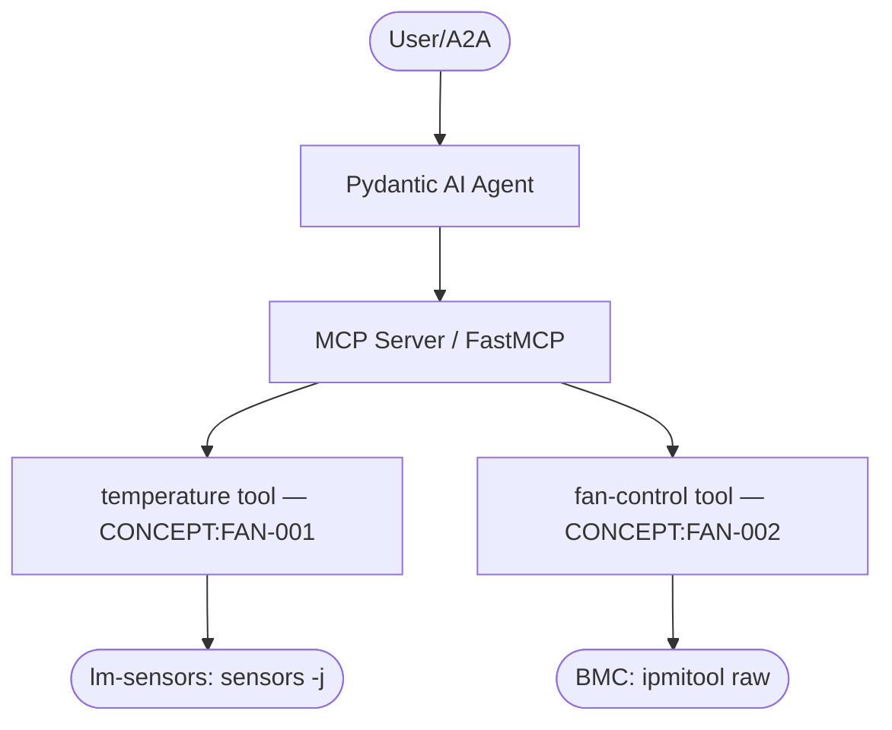

# fan-manager — Concept Overview

> **Category**: Infrastructure | **Ecosystem Role**: MCP Server + A2A Agent
> Built on [`agent-utilities`](https://github.com/Knuckles-Team/agent-utilities) — the unified AGI Harness.

## Description

Dell PowerEdge Fan Manager + MCP Server + A2A Server. Reads CPU/sensor
temperatures via `lm-sensors` and controls fan speed via `ipmitool`.

## Architecture



This project follows the standardized agent-package pattern:

```
fan-manager/
├── fan_manager/
│   ├── __init__.py
│   ├── fan_manager.py        # Core logic (CLI, sensors, IPMI)
│   ├── api_client.py         # Local-command facade (Api)
│   ├── models.py             # Pydantic input/output models
│   ├── auth.py               # No-op/local auth (no remote creds)
│   ├── mcp_server.py         # MCP entrypoint (create_mcp_server)
│   ├── agent_server.py       # A2A agent entrypoint
│   ├── agent_data/IDENTITY.md
│   └── mcp/                  # Action-routed tool modules
│       ├── mcp_temperature.py
│       └── mcp_fan_control.py
├── tests/
├── docs/
├── pyproject.toml
└── mcp_config.json
```

## Action-Routed Tool Surface

Each domain registers a single `@mcp.tool` accepting an `action` and a
`params_json` payload, then routes to the real callables. This keeps the LLM
tool count small while preserving the full method surface.

| Tool | Tag | Concept | Actions |
|------|-----|---------|---------|
| `fan_manager_temperature` | `temperature` | `CONCEPT:FAN-001` | `get`, `get_core` |
| `fan_manager_fan_control` | `fan-control` | `CONCEPT:FAN-002` | `set`, `auto` |

## Enterprise Readiness

All agents in the ecosystem inherit enterprise-grade infrastructure from
`agent-utilities`:

| Feature | Status | Source |
|:--------|:-------|:-------|
| **OpenTelemetry Instrumentation** | ✅ Built-in | `agent-utilities[logfire]` |
| **Audit Logging** | ✅ Built-in | Append-only compliance trail (CONCEPT:OS-5.4) |
| **Prompt Injection Defense** | ✅ Built-in | Pattern scanner + jailbreak taxonomy (CONCEPT:OS-5.1) |
| **Guardrail Engine** | ✅ Built-in | Input/output interception (CONCEPT:OS-5.3) |

> 📖 **Full Registry**: See [`agent-utilities/docs/overview.md`](https://github.com/Knuckles-Team/agent-utilities/blob/main/docs/overview.md) for the complete 5-Pillar concept index.
